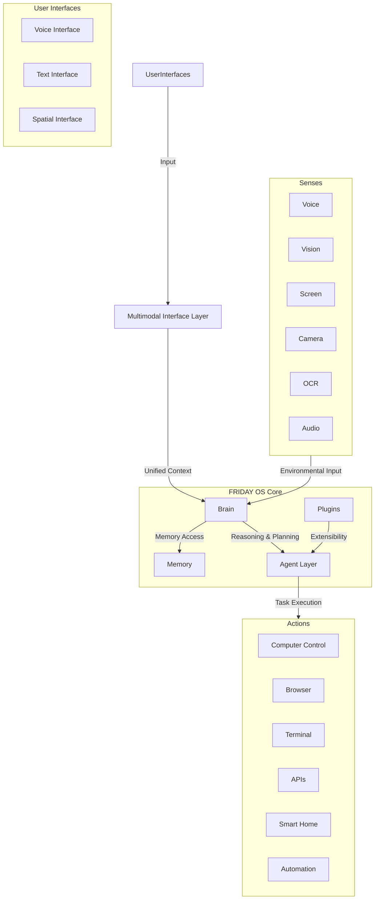

# FRIDAY OS Architecture

FRIDAY OS is designed as a modular, multi-layered system. This document outlines the high-level architecture.

## 1. Multimodal Interaction System

The user can interact with FRIDAY through multiple modalities. The Multimodal Interaction System is a crucial layer that unifies these inputs, ensuring seamless context switching and a consistent experience.

```
                 User
                   |
        /----------|----------\
       /           |           \
     Voice        Text        Spatial
       \           |           /
        \          |          /
         ---------------------
        | Multimodal Interface Layer |
         ---------------------
                   |
             FRIDAY Brain
                   |
       Agents + Memory + Tools
```

- **Voice Mode:** Hands-free, conversational interaction via a wake word ("Hey Friday"). Supports natural turn-taking, interruptions, and continuous conversation.
- **Text Mode:** For silent or detailed interaction via chat, a command palette, or a terminal interface.
- **Spatial Mode (Future):** Immersive interaction within a 3D knowledge environment, designed for AR/VR and spatial computing platforms.

The key function of this layer is to manage session and context regardless of the input method. A conversation started via voice can be seamlessly continued via text.

## 2. Core Components

- **The Brain:** The central processing unit of the OS, responsible for reasoning, planning, and decision-making.
- **Senses:** The input layer, allowing FRIDAY to perceive the world through various modalities.
- **Actions:** The output layer, enabling FRIDAY to interact with the digital and physical world.
- **Memory:** The persistence layer, storing knowledge, user preferences, and learned procedures.
- **Agent Layer:** The infrastructure for managing and executing specialized AI agents.
- **Interfaces:** The user-facing applications that capture input for the Multimodal Interaction System.

## 3. System Diagram



## 4. Component Breakdown

- **Brain:**
    - **Planner:** Breaks down complex goals into smaller, manageable tasks.
    - **Reasoner:** Makes logical inferences and decisions based on available information.
    - **LLM Core:** Leverages multiple large language models for generation and understanding.

- **Agent Layer:**
    - **Agent Manager:** Manages the lifecycle of agents (loading, unloading, monitoring).
    - **Agent Runtime:** Provides a secure and sandboxed environment for agent execution.
    - **Agent Communication Protocol:** A standardized protocol for inter-agent and agent-to-brain communication.
    - See `Agents.md` for more details.

- **Memory:**
    - **Memory Stores:** A multi-layered system including Working, Episodic, Semantic, Procedural, Preference, and Project memory.
    - **Memory Management:** Includes processes for importance scoring and lifecycle management to ensure relevance and efficiency.
    - See `Memory.md` for more details.

- **Plugins:**
    - A secure environment for third-party developers to extend FRIDAY's capabilities.
    - Plugins can add new tools, agents, or integrations.

- **Security:**
    - All components are isolated and communicate through well-defined APIs.
    - A robust permissions model controls agent access to tools and data.
    - User data is encrypted at rest and in transit.

## 5. Spatial Knowledge Environment (Second Brain Visualization)

To pioneer new forms of human-computer interaction, FRIDAY OS will feature a Spatial Knowledge Environment. This is not a storage system, but a **human-friendly visualization layer** for the underlying knowledge graph stored in databases, embeddings, and memory systems.

Inspired by interfaces like JARVIS and FRIDAY from Iron Man, this environment provides an intuitive way to explore FRIDAY's "mind."

- **Design:**
    - A central **Core** represents FRIDAY's unified intelligence.
    - Floating **Nodes** surround the core, representing discrete pieces of information (memories, projects, people, documents, skills, etc.).
    - **Relationship Lines** visually connect related nodes, illustrating the complex web of knowledge.

- **User Interaction:**
    - **Navigate Visually:** Users can move through layers of knowledge spatially.
    - **Zoom and Expand:** Zoom into a node to see its details or expand it to reveal connected nodes.
    - **Discover Connections:** The spatial layout helps uncover hidden relationships between different pieces of information.
    - **Reorganize Spatially:** Users can manually rearrange nodes to create personalized mental maps.

- **Future Interface Support:**
    This system is designed for future immersive platforms:
    - Desktop 3D Environments
    - AR/VR Headsets (e.g., Apple Vision Pro)
    - Interaction via gestures, hand tracking, and eye tracking.
