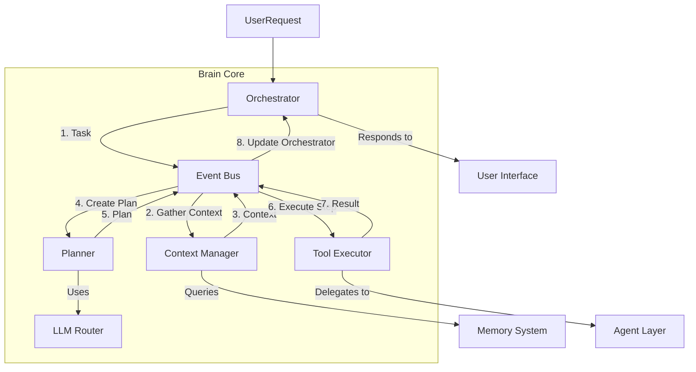

# FRIDAY OS: Brain Core Architecture

This document defines the architecture of the Brain Core, the central intelligence and orchestration layer of FRIDAY OS. It is a living document that will guide the implementation of the Brain's fundamental components.

## 1. Brain Responsibilities

The Brain is the central nervous system of FRIDAY OS. It is not a monolithic application but a collection of coordinated services that collectively provide the system's intelligence. Its primary responsibilities are:

- **Intent Recognition:** Accurately interpreting user requests from any connected interface (Voice, Text, etc.).
- **Strategic Planning:** Decomposing complex goals into discrete, executable steps.
- **Contextual Awareness:** Gathering and maintaining relevant information from the Memory system to inform decisions.
- **Orchestration:** Intelligently delegating tasks to specialized Agents and Tools.
- **State Management:** Managing the lifecycle of tasks from initiation to completion, including handling errors and interruptions.
- **Response Synthesis:** Assembling results from various tasks into a coherent and contextually appropriate response to the user.
- **Proactive Intelligence (Future):** Initiating actions based on events, schedules, or learned patterns without direct user commands.

## 2. Internal Architecture

The Brain Core is composed of several decoupled modules that communicate via a central Event Bus. This design ensures modularity, scalability, and maintainability.



- **Orchestrator:** The entrypoint and state manager for any given task.
- **Context Manager:** The Brain's connection to the Memory System.
- **Planner:** The strategic engine that creates plans to fulfill tasks.
- **LLM Router:** A service for selecting the optimal language model for a sub-task.
- **Tool Executor:** The component that interfaces with the Agent Layer to execute plan steps.
- **Event Bus:** The central communication backbone, decoupling the internal modules.

## 3. Module Boundaries

### Orchestrator
- **Responsibilities:**
    - Receives new tasks from interfaces (e.g., via the main system API).
    - Assigns a unique ID to each task.
    - Manages the high-level state of a task (e.g., `pending`, `in_progress`, `completed`, `failed`).
    - Initiates the task lifecycle by publishing a `task.created` event.
    - Listens for `task.completed` or `task.failed` events to finalize the process and synthesize the final response.
- **Interface:** Primarily event-driven. Listens for events indicating task completion or failure.

### Planner
- **Responsibilities:**
    - Listens for `plan.create` events.
    - Takes a user's intent and the associated context (provided by the Context Manager).
    - Uses an LLM (via the LLM Router) to break the intent down into a structured `PlanObject`.
    - A `PlanObject` is a list of sequential or parallel steps, where each step defines an agent to call or a tool to use with specific parameters.
    - Publishes the resulting `plan.created` event.
- **Interface:** Consumes `plan.create` events, produces `plan.created` events.

### Context Manager
- **Responsibilities:**
    - Listens for `context.gather` events.
    - Queries the various Memory Stores (Working, Episodic, Semantic, etc.) to build a comprehensive context payload for the current task.
    - The context includes user preferences, historical interactions, relevant facts, and project-specific data.
    - Publishes the `context.gathered` event with the context payload.
- **Interface:** Consumes `context.gather` events, produces `context.gathered` events.

### LLM Router
- **Responsibilities:**
    - Provides a standardized interface for other modules to access language models.
    - Contains logic to select the best model for a given job based on requirements like complexity, speed, cost, and privacy (e.g., use a local model for sensitive data).
    - Manages API keys, endpoints, and different provider SDKs (Gemini, OpenAI, Ollama, etc.).
- **Interface:** A synchronous API, likely gRPC-based. `LLMRouter.generate(prompt, constraints) -> response`.

### Event Bus
- **Responsibilities:**
    - Provides a pub/sub backbone for asynchronous communication between all Brain modules.
    - Guarantees message delivery and provides observability into the flow of events.
- **Technology:** Redis Pub/Sub for initial implementation, with a potential upgrade path to NATS or Kafka for greater durability and scalability.
- **Interface:** `EventBus.publish(topic, event_data)` and `EventBus.subscribe(topic)`.

### Tool Executor
- **Responsibilities:**
    - Listens for `task.step.execute` events.
    - For each step, it interfaces with the **Agent Layer** to dispatch the task to the correct agent.
    - It is a bridge between the Brain's conceptual plan and the Agent Layer's concrete execution environment.
    - It handles input/output marshalling for the agent.
    - Listens for results from the Agent Layer and publishes `task.step.completed` or `task.step.failed` events.
- **Interface:** Consumes `task.step.execute` events, produces step completion/failure events.

## 4. Data Flow

A typical request flows through the Brain as follows:

1.  **Request Ingestion:** The Orchestrator receives a user request (e.g., "Book a flight to New York for next Tuesday") and creates a new task with a unique `task_id`. It publishes a `task.created` event.
2.  **Context Assembly:** The Context Manager catches the `task.created` event, triggers a `context.gather` process, and retrieves relevant data (user's home airport, calendar, past travel). It then publishes a `context.gathered` event with the `task_id` and context payload.
3.  **Plan Generation:** The Planner catches the `context.gathered` event. It combines the original request and the new context into a prompt for the LLM Router to generate a step-by-step plan. The plan might look like:
    - `step 1: agent=search, tool=find_flights, params={...}`
    - `step 2: agent=user_comms, tool=ask_confirmation, params={...}`
    - `step 3: agent=booking, tool=book_flight, params={...}`
    The Planner publishes a `plan.created` event containing this plan.
4.  **Step Execution:** The Orchestrator, listening for the `plan.created` event, takes the plan and begins executing it. For each step, it publishes a `task.step.execute` event.
5.  **Tool/Agent Action:** The Tool Executor catches `task.step.execute`, invokes the appropriate agent via the Agent Layer, and awaits the result.
6.  **Result & Iteration:** The Tool Executor receives the result (e.g., a list of flights) and publishes a `task.step.completed` event. The Orchestrator receives this, updates the task state, stores the result in Working Memory (via a `memory.update` event), and proceeds to the next step.
7.  **Memory & Learning:** As the plan progresses, results and outcomes are continuously fed back into the Memory system, allowing FRIDAY to learn from its actions.
8.  **Response Synthesis:** Once all steps are complete, the Orchestrator publishes a `task.completed` event. A Response Synthesizer module (or the Orchestrator itself) assembles the final, user-facing response.

## 5. API Contracts

Module interactions will be defined by event schemas and gRPC service definitions.

**Event Schema (JSON):**
```json
{
  "event_id": "uuid",
  "task_id": "uuid",
  "event_name": "domain.event_name", // e.g., "task.created"
  "source": "module_name", // e.g., "Orchestrator"
  "timestamp": "iso_8601_datetime",
  "payload": { ... } // Event-specific data
}
```

**LLM Router API (gRPC/Protobuf):**
```proto
service LLMRouter {
  rpc Generate(GenerateRequest) returns (GenerateResponse);
}

message GenerateRequest {
  string prompt = 1;
  message Constraints {
    optional float temperature = 1;
    optional string model_preference = 2; // e.g., "fastest", "most_powerful"
    optional int32 max_tokens = 3;
  }
  Constraints constraints = 2;
}

message GenerateResponse {
  string content = 1;
  // Metadata about the model used, token counts, etc.
}
```

## 6. Event System Design

The event-driven architecture is critical for decoupling. Key events include:

- `task.created`: A new task has been initiated.
- `context.gather`: A request to assemble context for a task.
- `context.gathered`: Context has been assembled.
- `plan.create`: A request to create a plan for a task.
- `plan.created`: A plan has been successfully generated.
- `plan.failed`: The planner was unable to create a valid plan.
- `task.step.execute`: Request to execute a single step of a plan.
- `task.step.completed`: A plan step has finished successfully.
- `task.step.failed`: A plan step has failed.
- `task.completed`: The entire task has been completed.
- `task.failed`: The task has failed and will not be retried automatically.

## 7. Error Handling

- **Tool/Agent Errors:** The Tool Executor will catch errors from the Agent Layer. Depending on the error and the plan's instructions, it may:
    - Retry the step (with exponential backoff).
    - Use a fallback tool or agent.
    - Publish a `task.step.failed` event if the error is unrecoverable.
- **Planning Failures:** If the Planner cannot generate a valid plan, it will publish a `plan.failed` event. The Orchestrator can then trigger a re-planning attempt with more context or ask the user for clarification.
- **Module Failures:** Service health checks and circuit breakers will be implemented to prevent cascading failures. If a critical module like the Planner is down, tasks will be gracefully queued or rejected.

## 8. Security Boundaries

- **Tool Executor Sandboxing:** The Tool Executor itself does not run untrusted code. It delegates all execution to the **Agent Runtime**, which is responsible for providing a secure, sandboxed environment with strict permission enforcement as defined in `Agents.md`.
- **Data Sanitization:** The Orchestrator is responsible for sanitizing all incoming user input to prevent injection attacks.
- **Secret Management:** The Brain components themselves do not manage secrets (API keys, etc.). The LLM Router and Tool Executor request necessary secrets from a secure vault service at runtime. Secrets are never stored in plans or logs.
- **Permissions:** A plan step that requires elevated permissions (e.g., accessing files, spending money) must have a `permission_required: true` flag. The Orchestrator will halt execution and request explicit user confirmation before proceeding.

## 9. Testing Strategy

1.  **Unit Tests:** Each module will have comprehensive unit tests (`pytest`) with mocked dependencies (e.g., the Planner's tests will mock the LLM Router).
2.  **Integration Tests:**
    - Test module pairs (e.g., Planner and LLM Router).
    - Test event flow on the Event Bus: publish a `task.created` event and assert that the Context Manager picks it up correctly.
3.  **End-to-End (E2E) Tests:**
    - Create test scenarios that simulate a full user request.
    - Use mock Agents and a pre-populated test Memory database.
    - Assert that a given input (e.g., "What's the weather?") produces the expected output or side effect (e.g., a call to the `weather` agent).
4.  **Canary Testing:** For new planning models or agent versions, route a small percentage of live requests to the new version and monitor for regressions before a full rollout.

## 10. Future Expansion Path

This modular, event-driven design is built for evolution:

- **New Modules:** A new module, such as a `ProactiveTrigger` that initiates tasks based on external events (e.g., a calendar notification), can be added by simply having it publish a `task.created` event, requiring no changes to the existing core.
- **Advanced Planners:** The Planner module can be swapped out with more advanced versions (e.g., a hierarchical planner, a symbolic reasoner) without affecting other modules.
- **Scalability:** The Tool Executor and Agent Runtimes can be scaled horizontally and independently to handle increased load. The Event Bus can be upgraded to a more robust system like Kafka to handle millions of events.
- **Self-Improvement:** By analyzing the results of plans (stored in Episodic Memory), a future `PlanOptimizer` agent could learn to improve planning strategies over time, suggesting more efficient workflows that get stored in Procedural Memory.
