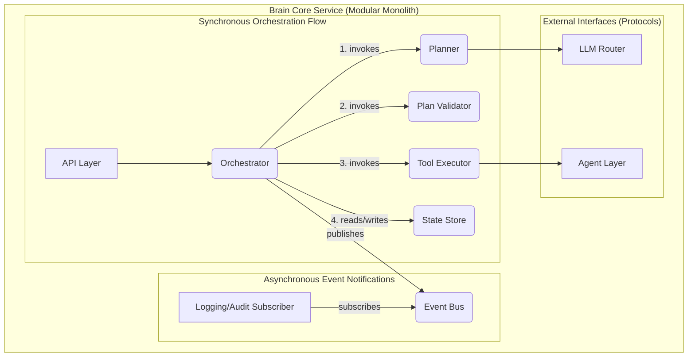

# FRIDAY OS: Brain Core Architecture

This document defines the architecture of the Brain Core, the central intelligence and orchestration layer of FRIDAY OS.

## 1. Deployment Model: Modular Monolith

For Phase 1, the Brain Core will be deployed as a **modular monolith**: a single, deployable FastAPI service. The internal design will enforce strict package boundaries and rely on dependency inversion, which allows for robust testing and facilitates a future transition to separate services if required. The goal is clean, maintainable code within a single process, not to simulate a distributed system.

## 2. Internal Communication: A Hybrid Model

Communication within the Brain Core uses a hybrid model.

### 2.1. Synchronous Protocol Calls
The primary workflow is a **synchronous orchestration** controlled by the `Orchestrator`. To ensure immediate results and clear control flow, the orchestrator invokes other internal modules (like the `Planner` or `Plan Validator`) via dependency-injected Python protocols (interfaces). This makes the primary request path deterministic and easy to follow.

### 2.2. Asynchronous Domain Events
The `EventBus` is used for **decoupled notifications**. It is not responsible for controlling the primary execution flow. Its purpose is to publish domain events for observability, auditing, and consumption by optional or external subscribers that do not need to return an immediate result to the orchestrator.

## 3. Architecture Diagram

## 4. Core Components and Interfaces

*   **Orchestrator:** The owner of the workflow. It executes the main task logic by making direct, synchronous calls to other modules via their interfaces. It is also responsible for publishing lifecycle events to the `EventBus`.
*   **Planner, Plan Validator, Tool Executor, etc.:** Modules that expose a clear protocol (interface) and are called directly by the `Orchestrator`. They contain the core business logic for their respective domains.
*   **State Store:** An interface for a key-value store used by the `Orchestrator` to manage task state.
*   **Event Bus:** An interface for publishing and subscribing to asynchronous domain events. Its primary role is notification, not workflow control.

## 5. Execution Flow Example

1.  **Synchronous Request:** An HTTP request hits the API layer.
2.  **Orchestration:** The `Orchestrator` is invoked. It creates a task, saves its initial state via the `StateStore` interface, and then immediately publishes a `task.created` event to the `EventBus`.
3.  **Direct Calls:** The `Orchestrator` proceeds to call the `Planner` and then the `Plan Validator` directly via their injected interfaces, awaiting the result of each call.
4.  **Execution:** Upon a valid plan, the `Orchestrator` calls the `Tool Executor`.
5.  **Notifications:** As the orchestrator completes each major step (planning, execution, completion), it publishes corresponding events like `task.plan_validated` or `task.completed` to the event bus.
6.  **Decoupled Listeners:** A logging service, subscribed to the event bus, receives these events and writes them to an audit log, without ever blocking the orchestrator.

## 6. Key Domain Events

The event bus is used for notifications about significant state transitions. These include:
- `task.created`
- `task.planning_started`
- `task.plan_validated`
- `task.execution_started`
- `task.completed`
- `task.failed`
- `task.cancellation_requested`
- `task.cancelled`

## 7. Personality Placement

For Phase 1, "Personality" is an injectable **presentation policy** used by the `Response Synthesizer`. It influences the style and tone of the final output but does not affect planning, execution, or security policy.

## 8. Security Boundaries

- **Plan Validation:** The `Plan Validator` protocol provides a mandatory, synchronous security gateway that all plans must pass through before execution.
- **Deny by Default:** The `Plan Validator` and `Tool Executor` must deny any tool or capability not explicitly allowed in their policies.
- **Local Development:** The service must bind to `127.0.0.1` by default and disable any tools that could interact with the host system.
