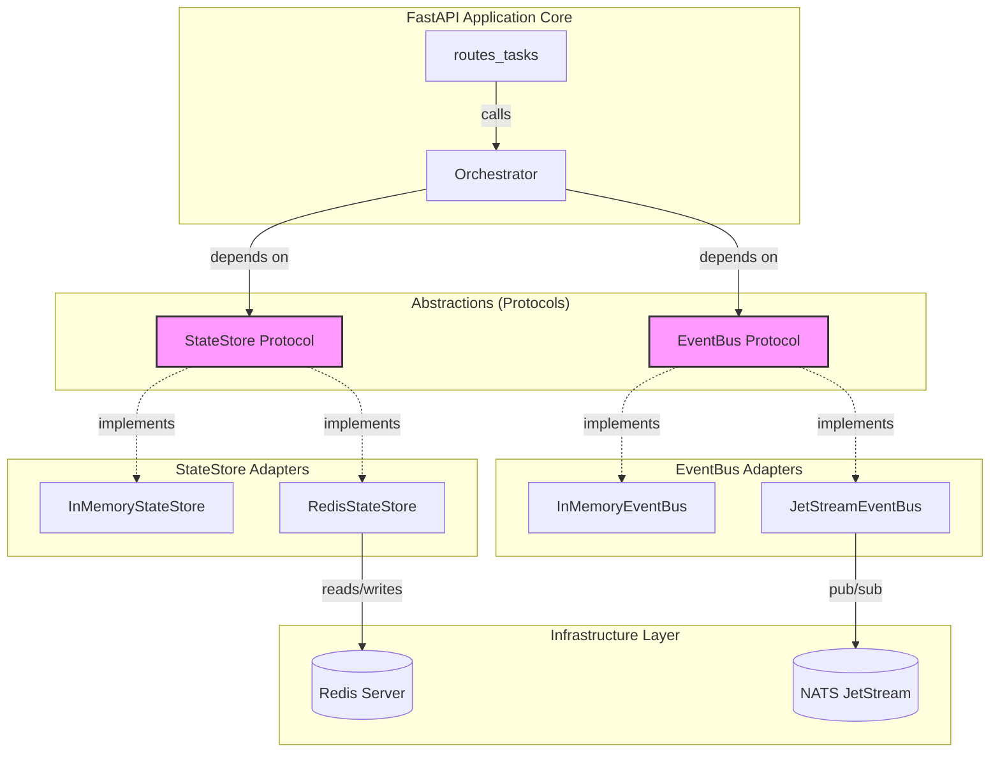

# FRIDAY OS: Brain Core Milestone 2 Design

## 1. Executive Summary

Milestone 2 introduces replaceable external infrastructure adapters into the FRIDAY OS Brain Core. It transitions the walking skeleton from Milestone 1 (which relied solely on ephemeral, in-process, and in-memory structures) to an external-infrastructure development baseline using high-performance, industry-standard external systems: **Redis** for hot operational state, and **NATS JetStream** for asynchronous domain eventing.

This milestone is critical because it demonstrates that the modular-monolith architecture defined in Phase 1 is decoupled from its infrastructure. By leveraging dependency inversion, we swap out in-memory implementations for real external systems entirely within the composition root, without changing any core business logic in the `Orchestrator`, `Planner`, `PlanValidator`, or `ToolExecutor`.

The Brain Core remains a **modular monolith** running within a single FastAPI process. It does not become a distributed microservices system in this phase. Swapping adapters allows the process to interact with external state and message systems, and enables communication with optional external subscribers.

---

## 2. Scope and Non-Goals

### 2.1. In Scope
*   **RedisStateStore Adapter:** A Redis-backed implementation of the `StateStore` protocol supporting fast serialization, idempotency key checks, optimistic concurrency control via task revisions, and configurable connection management.
*   **JetStreamEventBus Adapter:** A NATS JetStream-backed implementation of the `EventBus` protocol featuring configurable at-least-once redelivery behavior (via explicit acknowledgements, retry backoffs, and maximum delivery limits), subject-based routing, and custom failed-message handling.
*   **Docker Compose Dev Setup:** A lightweight local Docker Compose configuration to spin up NATS and Redis for local development.
*   **Contract Tests:** A unified test suite executed against both in-memory and external adapters to verify behavioral equivalence.
*   **Graceful Lifespan Management:** Bounded startup/shutdown routines wired to FastAPI's lifecycle to ensure clean socket closures, consumer draining, and robust health reporting.

### 2.2. Explicit Non-Goals
*   PostgreSQL task-history implementation (deferred to future milestones as the authoritative permanent system of record).
*   Transactional Outbox pattern (the current implementation utilizes direct synchronous state saving followed by best-effort asynchronous event publishing via the event bus).
*   Real LLM providers or memory engines (Qdrant, Neo4j).
*   Autonomous agents, voice, vision, browser control, or terminal execution.
*   Production-ready Kubernetes deployments, multi-user authorization, or advanced observability metrics.

---

## 3. Architecture Diagram

The diagram below details how the FastAPI application orchestrates execution while remaining completely decoupled from concrete infrastructure. The `Orchestrator` depends exclusively on the `StateStore` and `EventBus` protocols, allowing runtime selection between in-memory and external adapters.



---

## 4. RedisStateStore Design

### 4.1. Redis Key Naming & Structure
To prevent namespace collisions in shared Redis environments, keys will follow a structured hierarchical pattern:
*   **Task State:** `friday:brain:tasks:{task_id}` (Hash)
*   **Idempotency Key Index:** `friday:brain:idempotency:{idempotency_key}` (String containing the `task_id` UUID string)

### 4.2. Serialization & Schema Versioning
*   **Format:** Tasks are serialized into UTF-8 JSON strings using Pydantic’s `.model_dump_json()`.
*   **Schema Versioning:** The JSON payload includes a top-level `schema_version` field (integer, defaulting to `1`). If a payload with an unsupported or future schema version is retrieved, the adapter raises a `ValidationError`.

### 4.3. Idempotency Key Mapping
*   When checking/saving tasks with an idempotency key, a `SET friday:brain:idempotency:{idempotency_key} {task_id} NX` command is executed first.
*   If this returns `None`, an idempotency conflict is detected, and the adapter performs a lookup of the conflicting task by retrieving the associated `task_id` and calling `GET friday:brain:tasks:{task_id}`.

### 4.4. Optimistic Concurrency Control (OCC)
To prevent lost updates (e.g., when a task is updated simultaneously by an execution handler and a cancellation request), we implement an optimistic concurrency check:
*   The `Task` contract is extended to include a `version: int = 1` field.
*   Every task write updates this version (`task.version += 1`).
*   The `RedisStateStore` executes updates inside a Redis transaction using **optimistic locking (`WATCH`)**:
    1.  `WATCH friday:brain:tasks:{task_id}`
    2.  Retrieve the current task and check if the stored version matches the in-memory version.
    3.  If a mismatch is detected, the transaction is discarded, and the adapter raises an `InvalidStateTransitionError` or retryable lock conflict error.
    4.  Otherwise, execute `MULTI`, write the updated task JSON, and `EXEC`.

### 4.5. Lifespan and Cleanup
*   **Expiration Strategy:** Because Redis acts as an operational cache, active task keys will have a Time-To-Live (TTL) of **7 days** (`EXPIRE` set during writes). Completed, failed, or cancelled tasks maintain the same TTL to allow status retrieval before eviction.
*   **Connection Pooling:** Implements `redis.asyncio.ConnectionPool` with a configurable size (default `10`), connection timeout (`2.0s`), and socket keepalive enabled.
*   **Test Isolation:** Integration tests flush database indices specifically allocated for tests (`SELECT 15` and `FLUSHDB`) to ensure no state pollution.

### 4.6. Durability and Restart Recovery Limitations
*   **Operational State Only:** Redis acts strictly as a cache or hot store for active operational state, not as a permanent authoritative history database.
*   **Persistence Dependency:** Restart recovery for state stored in Redis is entirely dependent on the Redis server's configured persistence mechanisms (RDB snapshotting or Append-Only Files - AOF) and the underlying persistent storage.
*   **Data Loss Risk:** Depending on the specific persistence configuration (e.g., asynchronous RDB snapshots or relaxed AOF fsync settings), Redis may lose recent writes in the event of an abrupt process crash or power loss.
*   **Authoritative System of Record:** As detailed in the non-goals, a dedicated PostgreSQL database remains the future authoritative, durable task-history store for FRIDAY.

---

## 5. JetStreamEventBus Design

### 5.1. NATS Stream & Subject Design
*   **Stream Name:** `FRIDAY_EVENTS`
*   **Subject Pattern:** `friday.events.brain.*`
*   **Specific Event Subjects:**
    *   `friday.events.brain.task_created`
    *   `friday.events.brain.task_planning_started`
    *   `friday.events.brain.task_plan_validated`
    *   `friday.events.brain.task_execution_started`
    *   `friday.events.brain.task_completed`
    *   `friday.events.brain.task_failed`
    *   `friday.events.brain.task_cancellation_requested`
    *   `friday.events.brain.task_cancelled`

### 5.2. NATS JetStream Semantics and Delivery Guarantees
*   **At-Most-Once vs. At-Least-Once:** Core NATS protocol is strictly **at-most-once**. To achieve **at-least-once** redelivery behavior, we must utilize a properly configured JetStream stream backed by durable storage and durable pull consumers.
*   **Required Configuration:** At-least-once delivery requires explicit configuration of:
    *   Durable storage for the JetStream stream.
    *   Durable pull consumers.
    *   Explicit acknowledgement policy (`AckExplicit`).
    *   A defined `AckWait` timeout or exponential `BackOff`.
    *   A maximum delivery attempts threshold (`MaxDeliver`).
*   **No Exactly-Once Guarantees:** Duplicate publication and duplicate processing remain possible due to network partitions or consumer crashes during execution. FRIDAY **does not promise exactly-once processing**.
*   **Idempotent Consumers:** Because duplicates can be delivered, all event subscribers/consumers must be fully **idempotent**.

### 5.3. Consumer Naming & Delivery Parameters
*   **Consumer Naming Rule:** `friday_brain_consumer_{subscriber_name}`.
*   **Acknowledgement Policy:** Consumers must explicitly acknowledge messages (`AckExplicit`).
*   **Ack Wait Timeout:** 30 seconds. If a subscriber takes longer than this to acknowledge, JetStream will redeliver the message.
*   **Max Deliveries:** Set to `3`. If a message fails processing `3` times, NATS JetStream stops trying to redeliver it to this specific consumer.

### 5.4. Failed Messages and Advisory-Based Dead-Letter Strategy
*   **JetStream Behavior on Max Deliveries:** In NATS JetStream, once a message reaches its `MaxDeliver` limit, JetStream does *not* automatically move the message to a traditional dead-letter queue (DLQ). The original message remains in the main stream until it naturally expires or is explicitly deleted.
*   **Advisory Messages:** When `MaxDeliver` is reached, JetStream emits a maximum-delivery advisory on the system subject `$JS.EVENT.ADVISORY.CONSUMER_MAX_DELIVERIES.{stream}.{consumer}`.
*   **FRIDAY Failed-Event Architecture:** FRIDAY must implement an explicit administrative handler or background process to manage failed messages:
    1.  The handler listens to the max-delivery advisory subject.
    2.  Upon receiving an advisory, it extracts the message pointer, logs the failure, and publishes a safe, validated failure record to a dedicated failed-event stream (e.g., `FRIDAY_FAILED_EVENTS`).
    3.  Because this failed-event publisher is itself an event-driven flow, the handler must be strictly designed to **prevent infinite loops**:
        *   Advisories received from the failed-event stream itself are discarded/logged to static diagnostic storage rather than republished.
        *   The handler never attempts to execute business logic or task-processing code on the failed record, keeping it purely administrative.

### 5.5. Thread & Task Safety during Shutdown
*   During shutdown, subscriber loops stop fetching new messages (`pull`) and wait for currently running message handlers to complete, up to a bounded timeout of `5.0` seconds, before disconnecting from NATS.

---

## 6. Event Protocol Compatibility

The current `EventBus` protocol defines synchronous subscription, which is optimal for in-process handlers but needs extension to manage external connections and asynchronous consumer loops.

### 6.1. Proposed `EventBus` Protocol Extension
We will introduce asynchronous setup and teardown hooks to the protocol, allowing adapters to manage underlying client lifecycles cleanly.

```python
class EventBus(Protocol):
    async def start(self) -> None:
        """Initialize the event bus connection and start active background consumers."""
        ...

    async def stop(self) -> None:
        """Gracefully drain active consumers and close all network connections."""
        ...

    def subscribe(self, subscriber: Subscriber) -> None:
        """Register a handler for incoming events."""
        ...

    async def publish(self, event: Event[Any]) -> None:
        """Publish an event to the configured message channel."""
        ...
```

*   **No Leaking of Infrastructure Types:** Subscribers register standard application-level callback functions (`async def handler(event: Event[Any]) -> None`). The adapter internally wraps these callbacks, handles NATS-specific acknowledgements (`msg.ack()`), and translates connection errors into core `BrainError` types.

---

## 7. StateStore Protocol Compatibility

The current `StateStore` protocol is compatible with the transition to Redis, but requires formal async lifespan hooks.

### 7.1. Proposed `StateStore` Protocol Extension
```python
class StateStore(Protocol):
    async def start(self) -> None:
        """Initialize connection pools or local state caches."""
        ...

    async def stop(self) -> None:
        """Gracefully release connection pools and file handles."""
        ...

    async def save(self, task: Task) -> None:
        """Durable or transient write of the task state, checking for revision safety."""
        ...

    async def get(self, task_id: uuid.UUID) -> Task | None:
        """Retrieve a task by its unique identifier."""
        ...

    async def find_by_idempotency_key(self, idempotency_key: str) -> Task | None:
        """Look up a task via an idempotency key."""
        ...
```

*   **Immutability and Separation:** All domain objects returned by the store are deep-copied or fully parsed Pydantic objects. The core application logic does not hold references to Redis client objects.

---

## 8. Configuration

We introduce an updated `Settings` model in `friday_brain/config.py` that handles the configuration of active adapters and their corresponding network locations.

### 8.1. Configuration Schema (Pydantic Settings)
*   `BRAIN_ADAPTER_STATE_STORE`: `str` (choices: `in_memory`, `redis`, default: `in_memory`)
*   `BRAIN_ADAPTER_EVENT_BUS`: `str` (choices: `in_memory`, `nats`, default: `in_memory`)
*   `REDIS_URL`: `str` (default: `redis://localhost:6379/0`)
*   `REDIS_CONNECT_TIMEOUT_SEC`: `float` (default: `2.0`)
*   `REDIS_COMMAND_TIMEOUT_SEC`: `float` (default: `1.0`)
*   `NATS_URL`: `str` (default: `nats://localhost:4222`)
*   `NATS_CONNECT_TIMEOUT_SEC`: `float` (default: `2.0`)
*   `NATS_PUBLISH_TIMEOUT_SEC`: `float` (default: `2.0`)
*   `NATS_MAX_RECONNECT_ATTEMPTS`: `int` (default: `5`)

### 8.2. Local Development Settings (`.env.example`)
```env
# Adapter Configuration
BRAIN_ADAPTER_STATE_STORE=redis
BRAIN_ADAPTER_EVENT_BUS=nats

# External Services Locations
REDIS_URL=redis://127.0.0.1:6379/0
NATS_URL=nats://127.0.0.1:4222
```

---

## 9. Docker Compose Design

### 9.1. Local Development Only Disclaimer
The provided Docker Compose configuration is designed strictly for local development and testing. It MUST NOT be used in production. Specifically:
*   **Single-Node Services:** Both Redis and NATS run as single-node instances without clustering or failover replication.
*   **Localhost Exposure:** Ports are bound strictly to `127.0.0.1` to prevent exposure to external network interfaces.
*   **No High Availability:** The setup does not feature high availability (HA) or automatic failover.
*   **No Production Security Claims:** Services run with default or blank credentials, and traffic is unencrypted (no TLS configured).
*   **No Production Durability Claims:** Redis is explicitly configured with snapshot saving disabled (`--save ""`) to maximize ephemeral execution speed, meaning all state is lost when the container is stopped.

### 9.2. Service Definitions
*   **redis:**
    *   Image: `redis:7.2-alpine`
    *   Command: `redis-server --save ""` (Disables snapshot writing to disk for high-speed ephemeral local test runs)
    *   Ports: `127.0.0.1:6379:6379` (Bound to localhost only)
    *   Healthcheck: `redis-cli ping`
*   **nats:**
    *   Image: `nats:2.10-alpine`
    *   Command: `-js` (Enables JetStream capability explicitly)
    *   Ports: `127.0.0.1:4222:4222` (Bound to localhost only)
    *   Healthcheck: `wget --no-verbose --tries=1 --spider http://localhost:8222/healthz`

---

## 10. Health and Readiness

We expose two distinct endpoints to allow orchestrators (like Docker, Kubernetes, or load balancers) to monitor the service accurately. Liveness and readiness are strictly decoupled to ensure a process can be alive but marked unready (e.g., when experiencing transient backend connectivity issues).

### 10.1. Liveness `/health`
*   **Behavior:** Returns HTTP `200 OK` if the FastAPI web process is up and running.
*   **Dependencies:** Proves that the HTTP server is responsive and accepting connections. It does not query Redis or NATS. Even if NATS is offline or Redis is down, the process itself is alive.

### 10.2. Readiness `/ready`
*   **Behavior:** Proves whether the required configured adapters are fully usable. It queries the active infrastructure:
    *   If `redis` is configured, runs a lightweight `PING` command on the pool.
    *   If `nats` is configured, verifies that the connection status is `CONNECTED`.
*   **Distinct State:** A process may be alive (`/health` returns `200`) but not ready (`/ready` returns `503`) if any required downstream connection is lost.
*   **Response Codes:**
    *   `200 OK` if all configured external systems are responsive.
    *   `503 Service Unavailable` if any required adapter connection has failed or is degraded.

---

## 11. Dual-Write Consistency and Failure Behavior

### 11.1. Accepted Dual-Write Limitation
Milestone 2 performs state updates and event publications as two separate, non-transactional operations. Since the transactional outbox pattern is deferred, the system may successfully persist a task state change to Redis but fail to publish the corresponding event to NATS (due to a transient network partition, broker failure, or timeout). This is an accepted design limitation of Milestone 2.

### 11.2. Observable Behavior on Publication Failure
To handle dual-write inconsistency predictably without "best-effort" ambiguity, the system behaves as follows when an event publication fails:
*   **Synchronous API Calls (e.g., Task Creation):** If saving state succeeds but event publication fails during the synchronous request phase, the API will raise a `BrainError` ("event_publication_failed") with code `500 Internal Server Error`. The state remains updated in Redis (creating an inconsistency), but the client is explicitly notified of the failure.
*   **Asynchronous Processing Loops (e.g., Step Execution):** If publication fails during background step orchestration, the orchestrator will:
    1. Log a critical exception containing the task and event details.
    2. Record a pending-publication error condition in the task’s state.
    3. Transition the task itself to `FAILED` (with error details indicating publication failure) and attempt one final task-failure state save.
*   **Readiness Health Impact:** A failure to publish that is accompanied by a lost connection to NATS will subsequently cause the `/ready` readiness probe to fail, preventing the instance from receiving new traffic.

### 11.3. Failure Scenarios

| Failure Scenario | Component Impact | Application Action |
| :--- | :--- | :--- |
| **Redis Down at Startup** | State Store initialization | FastAPI application startup fails with a critical error and logs. Process exits. |
| **Redis Disconnects during Request** | Active workflow update | Aborts active request immediately, returns a retryable `500 Internal Server Error`, marks `/ready` as degraded. |
| **NATS Down at Startup** | Event Bus initialization | Application startup fails with a critical error. Process exits. |
| **Event Publication Fails** | Event Bus client | Log critical exception. If in synchronous API, raise `BrainError` (500) to client. If in background processing, record pending-publication error and transition task to `FAILED`. |
| **Serialized State Corrupt** | State Store parser | Log critical error, raise `ValidationError`, return `500` to client to protect state consistency. |
| **Shutdown during Active Work** | FastAPI Lifespan | Stop accepting new requests. Allow active task handlers `5.0` seconds to finalize, then force disconnection. |

---

## 12. Timeout and Retry Policy

All client calls to external infrastructure must be bounded to prevent thread starvation or socket leaks.

```text
Redis Commands:
  - Timeout: 1.0 second
  - Retry: 3 attempts with exponential backoff for read errors; no retries for write commands unless transactional state is safely verified.

NATS JetStream Publish:
  - Timeout: 2.0 seconds
  - Retry: 3 attempts with a 100ms base jittered delay.
```

---

## 13. Testing Strategy

### 13.1. Contract Tests
To prevent drift, we will reuse pytest classes (`StateStoreContract` and `EventBusContract`) to validate both in-memory and infrastructure-backed adapters.

```python
class TestRedisStateStore(StateStoreContract):
    @pytest.fixture
    async def store(self):
        # setup real Redis client pointing to test database
        # yield store
        # clean up
```

### 13.2. Integration Tests
These tests operate in a test environment with real Redis and NATS containers running. **Mocking is forbidden.** They will specifically assert:
*   Real concurrent updates and conflict resolutions.
*   Graceful recovery of subscribers when the NATS container is temporarily disconnected.
*   Proper DLQ publishing when a subscriber callback repeatedly raises validation errors.

---

## 14. Security

*   **Localhost-Only Exposure:** All ports mapped in Docker Compose must bind strictly to `127.0.0.1` to block external network scans on developer machines.
*   **Credential Handling:** Environment configuration parameters default to empty or secure dev credentials. Production credentials must be loaded via external secrets injection and never hardcoded.
*   **Log Redaction:** Task payloads or event details containing personal keys, user names, or credentials must never be written to stdout logs.

---

## 15. Implementation Sequence

### Phase 2A — Protocol Review
*   Extend `StateStore` and `EventBus` protocols with async `start()` and `stop()` lifecycle methods.
*   Update current `InMemoryStateStore` and `InMemoryEventBus` to comply with the updated signature and ensure all 49 existing tests pass.

### Phase 2B — Redis Adapter
*   Implement `RedisStateStore` inside `friday_brain/adapters/redis_state_store.py`.
*   Implement state versioning check and JSON serialization.
*   Map and verify `StateStoreContract` tests against the new adapter.

### Phase 2C — JetStream Adapter
*   Implement `JetStreamEventBus` inside `friday_brain/adapters/nats_event_bus.py`.
*   Ensure the adapter provisions the required `FRIDAY_EVENTS` stream and durable consumers dynamically on startup.
*   Write contract test adapters using NATS.

### Phase 2D — Composition, Configuration, and Lifespan
*   Update `Settings` and `CompositionRoot` to instantiate the correct adapters depending on environment variables.
*   Wire the `start()` and `stop()` calls to FastAPI’s lifespan handler in `main.py`.
*   Implement the `/ready` API endpoint.

### Phase 2E — Docker Compose
*   Write `docker-compose.yml` to orchestrate Redis and NATS JetStream locally.
*   Verify the entire walking skeleton lifecycle from task submission to completion against real running infrastructure.

---

## 16. Acceptance Criteria

*   The local development environment is runnable via a single `docker compose up` command.
*   No infrastructure-specific modules (`redis`, `nats`) are imported in any core domain directories (`application`, `contracts`, `protocols`).
*   All unit, contract, and integration tests pass successfully.
*   Graceful shutdown waits for active message processing to complete before disconnecting.
*   The `/ready` endpoint reports failure if Redis or NATS becomes unreachable.
*   The application continues to support in-memory adapters flawlessly when the environment variables are unset.

---

## 17. Definition of Done

- [x] Extended `StateStore` and `EventBus` protocols with `start()`, `stop()`, and `is_healthy()` lifecycle hooks.
- [x] Updated and verified existing in-memory adapters with the new protocol interfaces.
- [x] Added `RedisStateStore` with JSON serialization, 7-day TTL, and optimistic concurrency.
- [x] Added `JetStreamEventBus` supporting explicit ACKs, pull consumers, and max-delivery failed-event handling.
- [x] Extended the contract tests to cover Redis and NATS JetStream adapters using real infrastructure.
- [x] Added Docker Compose file (`compose.yaml`) with localized port mapping and robust health checks for Brain, Redis, and NATS.
- [x] Created `Dockerfile` for the Brain service, running as a non-root user.
- [x] Created `.dockerignore` to exclude unnecessary files from Docker builds.
- [x] Updated `.env.example` with configuration for Redis and NATS adapters, timeouts, and JetStream specifics.
- [x] Wired adapter lifespans to FastAPI startup and shutdown in `main.py`.
- [x] Added `/ready` endpoint for dependency-aware health checks, which degrades gracefully upon dependency loss.
- [x] Updated `services/brain/README.md` with comprehensive Docker Compose development instructions, including health checks and persistence.
- [x] Verified linting (`ruff`), formatting, and static typing (`mypy`) all report zero errors (implicitly by running the checks).
- [x] All Python tests pass with external services running (implicitly by running the tests).

---

## 18. Deferred Work
*   Persistent storage of completed tasks in PostgreSQL database (post-Milestone 2).
*   Transactional outbox patterns or complex multi-region delivery structures.
*   Production-ready Kubernetes deployments, multi-user authorization, or advanced observability metrics.

---

## FINAL VERDICT

MILESTONE 2E LOCAL COMPOSE COMPLETE
