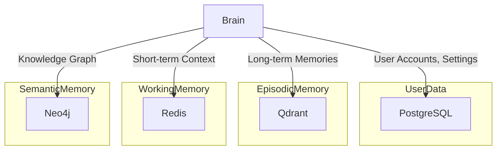

# FRIDAY OS Database

## Database Architecture

The database layer is responsible for the persistent storage of all data within FRIDAY OS. It is designed to be scalable, reliable, and secure, using a polyglot persistence approach to best suit the needs of different data types.

## Core Database Systems

- **PostgreSQL (Primary Relational Database):**
    - **Purpose:** To store structured data such as user accounts, settings, and agent configurations.
    - **Rationale:** A powerful and reliable open-source relational database with a rich feature set.
    - **Schema:** A detailed schema will be designed to represent the core entities of the system.

- **Qdrant (Vector Database):**
    - **Purpose:** To store and search high-dimensional vector embeddings for the Episodic Memory layer.
    - **Rationale:** A high-performance vector database that is optimized for semantic search.
    - **Usage:** Used to store embeddings of text, images, and other data for fast similarity search.

- **Redis (In-Memory Cache):**
    - **Purpose:** To provide a fast and volatile in-memory cache for the Working Memory layer.
    - **Rationale:** An industry-standard in-memory data store that provides low-latency access to data.
    - **Usage:** Used to store temporary information such as the current conversation context.

- **Neo4j (Graph Database):**
    - **Purpose:** To store the Semantic Memory (Knowledge Graph) as a graph of interconnected entities.
    - **Rationale:** A native graph database that is optimized for storing and querying complex relationships.
    - **Usage:** Used to model the user's world, including people, places, and concepts.

## Data Flow Diagram

## Data Management

- **Migrations:** Database schema changes will be managed through a migration tool (e.g., Alembic).
- **Backups:** Regular backups of all databases will be performed to prevent data loss.
- **Data Retention:** Users will have control over data retention policies and can delete their data at any time.
